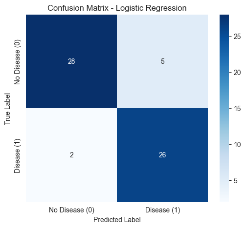
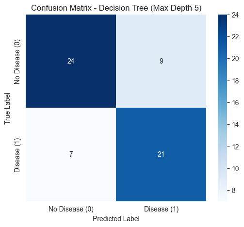

# Heart Disease Prediction Project

**Author:** Saratachandra Golla  
**Date:** 11/09/2025

## Project Goal

The goal of this project is to predict the presence of heart disease (Class 1) versus no disease (Class 0) using clinical data from the Cleveland heart disease dataset. The project involves data cleaning, exploratory analysis, feature preprocessing, and a comparative evaluation of two classification models: **Logistic Regression** and a **Decision Tree Classifier**.

## Dataset

The project uses the **Cleveland Heart Disease** dataset from the UCI Machine Learning Repository. It contains 14 attributes collected from 303 patients.

- **Features (X):** 13 clinical features including `age`, `sex`, `cp` (chest pain type), `trestbps` (resting blood pressure), `chol` (serum cholestoral), `thalach` (maximum heart rate achieved), etc.
- **Target (y):** The `target` variable, indicating the presence of heart disease. It was converted from a multi-class variable (0-4) to a binary variable (0 = No Disease, 1 = Disease).

## Installation

To run this project locally, follow these steps:

1.  **Clone the repository:**
    ```bash
    git clone <your-repo-url>
    cd ml_classification_sgolla
    ```

2.  **Create and activate a virtual environment:**
    ```bash
    python -m venv .venv
    source .venv/bin/activate  # On Windows, use `.venv\Scripts\activate`
    ```

3.  **Install the required dependencies:**
    ```bash
    pip install -r requirements.txt
    ```

## Usage

All analysis and modeling are contained within the Jupyter notebook. To explore the project, start Jupyter Lab:

```bash
jupyter lab
```

Then, open and run the `classification_sgolla.ipynb` notebook.

## Methodology

The project follows a structured machine learning workflow:

1.  **Data Loading and Cleaning:** The data was loaded, and missing values (represented by `?`) in the `ca` and `thal` columns were identified and imputed using the most frequent value (mode).
2.  **Target Variable Transformation:** The multi-class `target` (0-4) was converted into a binary target where `0` represents no disease and `1` represents any level of disease.
3.  **Exploratory Data Analysis (EDA):**
    - The target class distribution was found to be slightly imbalanced (~54% Disease vs. 46% No Disease).
    - Visualizations showed that patients with heart disease tend to have a lower maximum heart rate (`thalach`).
4.  **Preprocessing and Feature Engineering:** A `scikit-learn` pipeline was built to prepare the data for modeling:
    - **Numerical Features** (`age`, `trestbps`, `chol`, etc.) were scaled using `StandardScaler`.
    - **Categorical Features** (`sex`, `cp`, `fbs`, etc.) were transformed using `OneHotEncoder`.
5.  **Data Splitting:** The data was split into training (80%) and testing (20%) sets using `StratifiedShuffleSplit` to preserve the class distribution in both sets.

## Model Comparison and Results

Two models were trained and evaluated. The key evaluation metrics were **Accuracy**, **F1-Score**, and **Recall** for the "Disease" class, as minimizing false negatives is critical in a medical context.

| Metric              | Logistic Regression | Decision Tree |
| ------------------- | ------------------- | ------------- |
| **Accuracy**        | 0.8852              | 0.7377        |
| **F1-Score (Disease)** | 0.8814              | 0.7241        |
| **Recall (Disease)**   | 0.9286              | 0.7500        |

---

### 1. Logistic Regression (Winner)

The Logistic Regression model was the top performer. It achieved an **accuracy of 89%** and an excellent **Recall of 93%** for the disease class.

**Confusion Matrix - Logistic Regression**

```
[[28  5]
 [ 2 26]]
True Negatives: 28 | False Positives: 5
False Negatives: 2  | True Positives: 26
```

### 2. Decision Tree Classifier

The Decision Tree (with `max_depth=5` to prevent overfitting) performed less effectively, with an **accuracy of 74%** and a **Recall of 75%**.

**Confusion Matrix - Decision Tree**

```
[[24  9]
 [ 7 21]]
True Negatives: 24 | False Positives: 9
False Negatives: 7  | True Positives: 21
```

## Reflection: Which Model Performed Better and Why?

The **Logistic Regression** model performed significantly better than the Decision Tree.

**Key reasons for its effectiveness:**

1.  **Linear Separability:** After preprocessing (scaling and one-hot encoding), the problem appears to be largely linearly separable. Logistic Regression excels at finding a simple, robust hyperplane to separate classes in such scenarios.
2.  **Robustness on Small Datasets:** Decision Trees are prone to overfitting on smaller datasets. Even with a limited depth, the tree likely learned noise from the training data that didn't generalize. Logistic Regression, being a simpler model, is less susceptible to this and often generalizes better.
3.  **Impact of Feature Scaling:** The `StandardScaler` is critical for Logistic Regression's performance, ensuring all features contribute proportionally. This step was a key reason the linear model performed so well.

## Future Work

If more time were available, the following steps could be taken:

1.  **Hyperparameter Tuning:** Use `GridSearchCV` to find the optimal regularization strength (`C`) for the Logistic Regression model to potentially boost performance further.
2.  **Ensemble Methods:** Implement a **Random Forest Classifier** to see if an ensemble of trees can outperform the single Logistic Regression model.
3.  **Feature Engineering:** Create new, more informative features from the existing data, such as risk categories for cholesterol or blood pressure.
